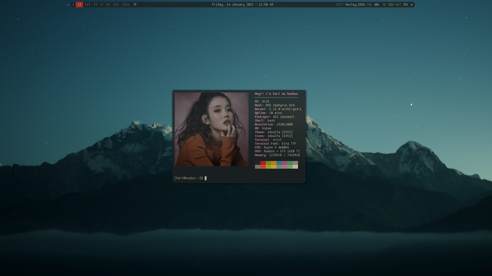
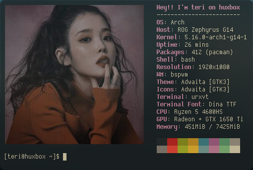
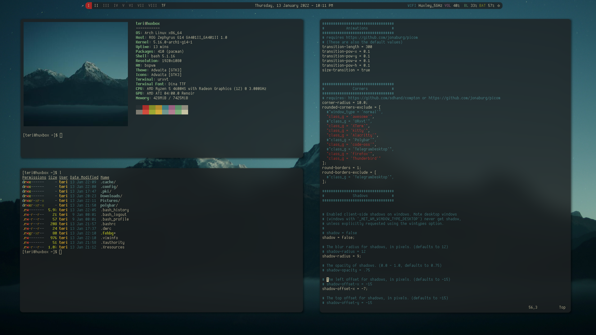
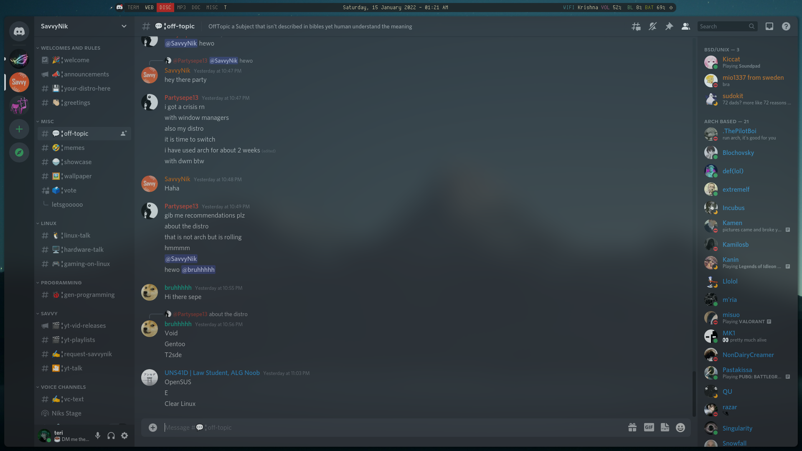

# gruvbox-dark-bspwm
* I got bored and re-installed arch but with dark gruvbox theme this time.
* Variant of the first rice I made.
* Details at the end of README

# Preview
## Desktop preview

## Neofetch preview

## Workflow showcase

## Discord preview

# Details
* OS: Arch
* WM: bspwm
* Terminal: urxvt
* Fonts: `dina-font-ttf`, `dina-font-otb` (for dunst) and `siji-ng` (for polybar power button).
All fonts are from AUR
* X compositor: `picom-jonaburg-fix` from AUR by Arian8j2
* Wallpaper: https://unsplash.com/photos/v7daTKlZzaw
* Neofetch script: Edited by me, only works for me.
* Neofetch picture: Downloaded from a random website I can't even recall or find again.
